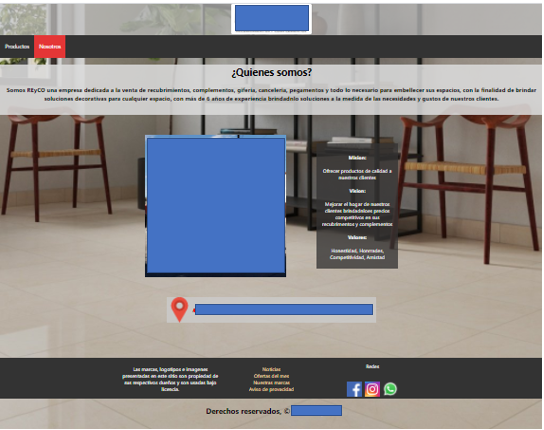
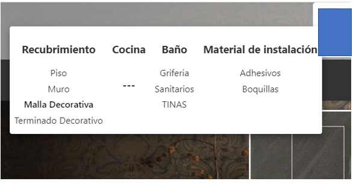
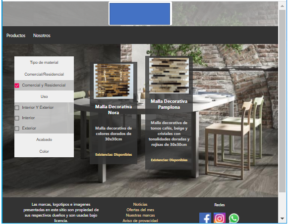

# Pagina Inventario

Aplicacion en ReactJS util para tiendas de tamaño medio.

_Funciones_
* publicitar los productos de nuesta tienda
* filtrar productos por categorias
* dar a conocer los precios de nuestros productos como si hay o no existencias
* mostrar promociones
* mostrar ubicacion fisica de nuestra tienda
* dar a conocer la tienda
* controlable desde la applicacion [App-inventario](https://github.com/AlonsoAlvarez/Inventario-open-source)

_Apariencia_







## Comenzando 🚀

- Descargar y descomprimir el proyecto

### Pre-requisitos 📋

_Necesario_

```
- Entusiasmo jeje (XD)
- React instalado
- App inventario insatalda
- Cuenta gmail
- Experiencia con Firebase
```

### Instalación 🔧

_Pasos para correr proyecto_

_1. Ve a [Firebase Console](https://console.firebase.google.com)_

```
- Seleccionar el proyecto donde este montada la Applicacion inventario
- Agregar Firebase a nuestra App web
- Copiar la configuracion "firebaseConfig"
- Pegar la configuracion en /src/firebase.js
```

## Ejecutando las pruebas ⚙️

_Inicia la alpicación en modo dev con "yarn start"_

## Despliegue 📦

_Crea la Aplicación en modo release con el comando "yarn build"_

_Hostea y divertete_

## Construido con 🛠️

_Para este proyecto se utilizó_

* [ReactJS](https://es.reactjs.org/)
* [Firebase](https://console.firebase.google.com/)

## Autores ✒️

_Mencion a todos aquellos que ayudaron a levantar el proyecto desde sus inicios_

* **Alonso Alvarez** - *Codificacion* - [AlonsoAlvarez](https://github.com/AlonsoAlvarez)


---
⌨️ con ❤️ por [AlonsoAlvarez](https://github.com/AlonsoAlvarez) 😊# Inventario-open-source
